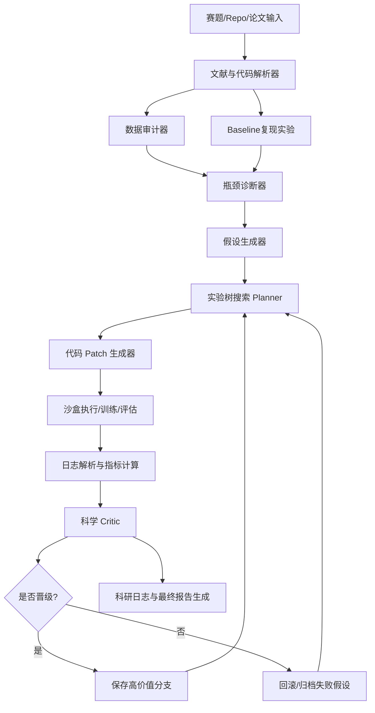

# AI4S 智能体 CNS 挑战赛：PDE 神经算子科研 Agent 冠军级方案

## 一、完善后的完整 Prompt

```text
你是一个顶级 AI4S 竞赛技术总架构师、PDE 神经算子研究员、自动化科研 Agent 设计专家和 ML 工程负责人。

背景：
我正在参加第四届世界科学智能大赛 AI4S 智能体 CNS 挑战赛中的“神经算子 PDE 智能体”赛题。该赛题不是传统提交模型权重的比赛，而是要求开发一个能在零人工干预环境下自主完成“理解—改进—验证—复现”的科研闭环 Agent。研究对象是神经算子，主要面向 PDEBench 标准科学数据集，参考基线包括 FNO、DeepONet、PI-DeepONet、ICON 等。Agent 需要阅读论文和代码、分析日志、提出假设、修改代码、运行实验、调试错误、评估结果并输出完整科研日志。

最终目标：
构建一个在官方评测中获得尽可能最高分的科研 Agent。该 Agent 不仅要提升神经算子模型的科学性能，还要在探索效率、计算经济性、演进逻辑严密性、可解释性、可复现性方面表现优异。

请完成以下任务：

1. 赛题深度拆解
   - 拆解赛题目标、任务形式、输入输出、Agent 应具备的能力、潜在评分维度。
   - 判断这类赛题真正的得分点，而不是仅从传统模型竞赛角度理解。

2. SOTA 调研
   - 系统调研近 5 年神经算子和 PDE 学习相关 SOTA 方法，包括但不限于：
     FNO、DeepONet、PI-DeepONet、PINO、ICON、GNOT、Geo-FNO、GINO、F-FNO、TFNO、MG-TFNO、PDE-Refiner、扩散式 PDE 长时预测、物理约束损失、谱域损失、守恒约束、多步 rollout 训练、U-Net/FNO 混合结构等。
   - 系统调研自主科研 Agent / ML Agent 相关方法，包括：
     MLAgentBench、MLE-bench、AIDE、SWE-agent、OpenHands、AI Scientist、Agent Laboratory 等。
   - 对每种方法给出核心思想、优势、缺点、适用条件、工程落地难度、对本赛题的价值。

3. 冠军级 Agent 架构设计
   - 设计一个能自主科研闭环的 PDE Agent。
   - 必须包含：
     文献解析模块、代码仓库理解模块、数据审计模块、实验设计模块、代码演进模块、实验执行模块、日志分析模块、假设管理模块、多分支搜索模块、模型改进库、科学日志生成模块、回退机制。
   - 给出模块间数据流和控制流。

4. 神经算子优化策略
   - 给出 Agent 可以自动尝试的模型改进策略库。
   - 包含：
     架构改进、损失函数改进、数据增强、训练策略、rollout 稳定性、物理一致性、频域误差控制、边界/守恒约束、低成本超参搜索、模型融合。
   - 给出优先级排序：哪些最应该先做，哪些作为后期冲榜方案。

5. 评分最大化策略
   - 针对科学性能、计算经济性、演进逻辑严密性三类评分目标分别设计优化方案。
   - 给出如何让评委或自动评测系统看到 Agent 的“科学推理能力”，而不只是看到结果分数。

6. 工程落地方案
   - 给出推荐项目目录结构。
   - 给出 Agent 主循环伪代码。
   - 给出实验日志 schema。
   - 给出模型改进 patch 机制。
   - 给出训练、评估、回滚、提交前检查流程。

7. 四周冲刺计划
   - 按周给出目标、产物、风险、验收标准。
   - 需要能在有限算力下尽快跑出稳定结果，并逐步向高分方案演进。

输出要求：
- 用中文输出。
- 不要空泛，要尽量工程化。
- 每个建议都要说明为什么对本赛题有帮助。
- 必须区分“必做保底项”和“冲榜创新项”。
- 最终输出：
  1）技术路线图
  2）SOTA 方法对照表
  3）Agent 架构设计
  4）神经算子优化策略库
  5）四周执行计划
  6）风险与回退机制
  7）第一天马上可以执行的任务清单
```

---

## 二、赛题重新判断：这不是“调模型比赛”，而是“自动科研系统比赛”

该赛题的核心参赛对象不是单一神经算子模型，而是一个能自主完成科研闭环的 PDE Agent。任务四“神经算子 PDE 智能体”要求以 FNO、DeepONet、ICON 等为基线，依托 PDEBench，开发能够自主完成“理解—改进—验证—复现”的全科研闭环智能体，而不是只提交训练好的权重。

因此冠军策略应该是：

> 不是只做一个最强 FNO，而是做一个“能稳定发现更强 FNO / DeepONet / Refiner 改进方案的 Agent”。

建议把最终系统拆成三层：

1. **Agent 科研闭环层**：负责理解代码、提出假设、改代码、跑实验、分析日志、写科研记录。
2. **神经算子方法库层**：内置一批可自动尝试的强改进模块，如 F-FNO、TFNO、谱域损失、PDE residual、PDE-Refiner、多步 rollout。
3. **评分最大化层**：控制算力、实验优先级、回退机制和科学日志质量，确保不只结果好，而且过程“像科学家”。

---

## 三、最高分策略总览

### 1. 真实得分点

| 得分维度 | 官方/公开含义 | 我们的对应策略 |
|---|---|---|
| 科学性能 | 优化后模型或方案在预测精度、泛化能力上的表现 | 自动改进 FNO / DeepONet / ICON / PDEBench baseline，优先优化 nRMSE、长时 rollout、物理一致性 |
| 探索效率与计算经济性 | 计算时间、迭代周期、资源利用 | 多保真评估、早停、实验树搜索、低成本 proxy score、只把高潜力 patch 晋级 |
| 演进逻辑严密性 | 决策链透明、假设到代码演进可解释 | 每次实验强制生成 hypothesis → patch → metric → conclusion → next action 的科研日志 |

### 2. 冠军级核心路线

建议采用：

> **AIDE 式树搜索 + SWE-agent 式代码接口 + PDEBench 专用科研工具链 + 神经算子改进库。**

AIDE 的关键优势是把多个方案组织成树结构，能系统性起草、调试和改进代码；这非常适合本题的“多假设、多分支科研演进”。SWE-agent 的价值在于证明专门设计的 agent-computer interface 能显著提升代码定位、编辑、测试和修复能力。MLAgentBench 和 MLE-bench 说明，长周期 ML 实验 Agent 的核心挑战是规划、代码执行、错误恢复、实验判断，而这正是本题要测的能力。

---

## 四、SOTA 方法对照表：本题最值得用的技术

| 方法 | 核心思想 | 对本题价值 | 优先级 |
|---|---|---|---|
| **FNO** | 在 Fourier 空间参数化积分核，学习函数到函数的算子映射 | 官方基线之一，必须先复现；适合规则网格 PDEBench | 必做 |
| **DeepONet** | branch/trunk 结构学习非线性算子 | 官方参考基线，适合参数化 PDE 和算子学习解释 | 必做 |
| **PI-DeepONet** | 在 DeepONet 中加入 PDE 物理约束，可在无配对输入输出数据时学习解算子 | 适合提升物理一致性与解释性 | 高 |
| **PINO** | 把数据监督和高分辨率 PDE residual 结合到神经算子训练 | 对 hidden test 和跨分辨率泛化很有价值 | 高 |
| **ICON** | 用 data prompts 做 in-context operator learning，推理时无须权重更新适应新算子 | 若官方评测含未见 PDE / 参数族，非常有价值 | 中高 |
| **F-FNO / TFNO / MG-TFNO** | 分解 Fourier 层、张量化参数、多网格并行，降低参数和高分辨率成本 | 同时提升科学性能和计算经济性 | 高 |
| **GNOT** | Transformer 式通用神经算子，支持不规则网格、多输入函数、多尺度问题 | 若数据格式复杂或多物理变量，适合作为冲榜分支 | 中 |
| **Geo-FNO / GINO** | 面向任意几何 / 不规则网格的神经算子 | 如果 PDEBench 子任务含几何变化或不规则网格再启用 | 条件启用 |
| **PDE-Refiner** | 用扩散式多步 refinement 修正 PDE rollout，解决长时预测高频误差累积 | 本题明确关注长时稳定性，非常适合冲高分 | 高 |
| **物理 / 谱域 / 守恒损失** | 加入 PDE residual、边界误差、守恒误差、Fourier band error | 直接对齐 PDEBench 多维评价指标 | 必做 |

PDE-Refiner 是本题非常关键的冲榜方法，因为它直接针对“长时 rollout 不稳定”问题，指出常见 neural PDE solver 会忽视低幅值高频信息，并用扩散式多步 refinement 提升长时预测稳定性和不确定性估计。MG-TFNO 则针对高分辨率 PDE 的内存复杂度和数据稀缺问题，通过多网格域分解与张量化 Fourier 参数提升扩展性和压缩率。

---

## 五、冠军级 Agent 架构



### 核心模块

#### 1. Paper & Code Reader

读取论文、README、baseline 代码、配置文件、训练脚本。输出：

```json
{
  "model_family": "FNO",
  "data_shape": "...",
  "loss": "...",
  "metrics": ["RMSE", "nRMSE", "cRMSE", "bRMSE", "fRMSE"],
  "bottleneck_candidates": ["high_freq_error", "rollout_drift", "boundary_violation"]
}
```

#### 2. PDEBench Auditor

PDEBench 原论文和仓库提供 FNO、U-Net、PINN 等 baseline，并强调不仅要看 RMSE，也要用 nRMSE、最大误差、守恒误差 cRMSE、边界误差 bRMSE、Fourier 频段误差 fRMSE 等多维指标评价科学 ML 模型。

所以 Agent 的第一件事不是训练，而是做数据和指标审计。

#### 3. Hypothesis Engine

每个假设必须是结构化的：

```json
{
  "hypothesis_id": "H-FFT-001",
  "observation": "FNO baseline 在长时 rollout 后 high-frequency fRMSE 快速上升",
  "cause": "spectral truncation + one-step loss 导致高频误差被忽略",
  "proposed_patch": "加入 high-frequency weighted spectral loss + multi-step rollout loss",
  "expected_metric_gain": ["fRMSE_high", "long_rollout_nRMSE"],
  "risk": "可能降低短期 RMSE 或训练变慢",
  "budget": "low_to_medium"
}
```

#### 4. Code Evolution Engine

不允许 Agent 随机乱改。每次 patch 必须落在以下白名单内：

- `models/`：架构修改
- `losses/`：损失函数修改
- `trainers/`：训练策略
- `configs/`：超参
- `metrics/`：新增评价
- `reports/`：科研日志

#### 5. Experiment Tree Search

借鉴 AIDE 的树状搜索，不采用单线性迭代。每个节点代表一个代码版本，每条边代表一次科学假设驱动的改动。这样可以同时满足“探索效率”和“演进逻辑严密性”。

---

## 六、神经算子优化策略库

### 必做保底策略

| 策略 | 目标 | 说明 |
|---|---|---|
| Baseline 复现 | 建立可信评价 | 先复现 FNO / U-Net / PINN / DeepONet，校准本地指标 |
| 统一指标面板 | 防止只优化 RMSE | 加入 nRMSE、max error、cRMSE、bRMSE、fRMSE |
| 多步 rollout loss | 提升长时稳定性 | 不只学一步预测，直接惩罚未来多步误差 |
| 谱域损失 | 修复高频退化 | 对 fRMSE high / mid 加权，尤其针对 Burgers / Navier–Stokes |
| 边界 / 守恒损失 | 提升物理一致性 | 对 boundary condition 和 conserved quantity 显式约束 |
| 噪声增强 | 提升鲁棒性 | 对输入状态、初值、参数加入小噪声 |
| 早停 + 多保真评估 | 省算力 | 小 epoch、小分辨率、小数据子集先筛分支 |

### 冲榜创新策略

| 策略 | 目标 | 使用条件 |
|---|---|---|
| F-FNO / TFNO 替换 FNO 层 | 更强频域建模、降低参数 | 规则网格、FNO baseline 明显强 |
| PDE-Refiner head | 改善长时 rollout | 评测重点包含时序预测 |
| PINO residual | 提升物理泛化 | PDE 方程形式可从数据 / 配置中拿到 |
| ICON-like in-context adaptation | 未见 PDE / 参数快速适应 | hidden test 可能跨 PDE family |
| Ensemble of small specialists | 稳定 hidden test | 不同 PDE 子任务差异明显 |
| Uncertainty gate | 防止坏分支污染最终结果 | 多模型或 diffusion / refiner 可输出不确定性 |

最推荐的第一版模型改进组合是：

```text
FNO/TFNO backbone
+ local U-Net residual branch
+ multi-step rollout loss
+ spectral loss
+ boundary/conservation penalty
+ optional PDE-Refiner correction head
```

这套组合兼顾准确率、长时稳定性、物理一致性和工程落地速度。

---

## 七、评分最大化设计

### 1. 科学性能

核心 proxy score：

\[
S =
0.35(1-\text{nRMSE})
+0.15(1-\text{MaxErr})
+0.15(1-\text{fRMSE}_{high})
+0.15(1-\text{bRMSE})
+0.10(1-\text{cRMSE})
+0.10(1-\text{rollout\_drift})
\]

PDEBench 本身强调 RMSE / nRMSE / max error / cRMSE / bRMSE / fRMSE 等指标，因此这个 proxy 与 benchmark 逻辑高度一致。

### 2. 探索效率与计算经济性

Agent 必须采用三阶段评估：

```text
Stage 1: smoke test
- 只跑 1 个 batch / 1 个 epoch
- 检查代码是否能运行、shape 是否正确、loss 是否有限

Stage 2: proxy validation
- 小数据、小 epoch
- 判断趋势是否超过 baseline

Stage 3: full validation
- 只让前 10% 高潜力分支进入完整训练
```

这样比“每个想法都完整训练”更符合官方对计算经济性的要求。

### 3. 演进逻辑严密性

每次实验必须生成一条完整科研日志：

```markdown
## Experiment E023

### Observation
FNO baseline 在 2D Navier-Stokes 长时 rollout 中 high-frequency fRMSE 上升。

### Hypothesis
高频分量在 one-step MSE 中权重过低，导致 rollout 误差累积。

### Intervention
加入 Fourier high-band weighted loss，并将 rollout horizon 从 1 提升到 4。

### Code Patch
- losses/spectral_loss.py
- trainers/rollout_trainer.py
- configs/fno_spectral.yaml

### Result
proxy nRMSE: 0.138 -> 0.126
fRMSE_high: 0.071 -> 0.052
training cost: +18%

### Decision
晋级到 full validation；下一步测试不同 high-band 权重。
```

这类日志会显著增强“科研 Agent 感”，而不是普通 AutoML。

---

## 八、推荐项目目录结构

```text
pde_research_agent/
  README.md
  configs/
    agent.yaml
    budget.yaml
    eval.yaml
    methods/
      fno_base.yaml
      tfno_spectral.yaml
      pde_refiner.yaml

  agent_core/
    orchestrator.py
    planner.py
    memory.py
    hypothesis_engine.py
    critic.py
    report_writer.py

  skills/
    repo_reader.py
    data_auditor.py
    paper_summarizer.py
    log_parser.py
    metric_analyzer.py
    patch_generator.py
    experiment_runner.py

  pde_tools/
    metrics.py
    spectral_loss.py
    physics_residual.py
    rollout_eval.py
    boundary_checker.py
    conservation_checker.py

  model_zoo/
    fno/
    deeponet/
    tfno/
    ffno/
    unet_residual/
    pde_refiner/
    icon_adapter/

  experiments/
    tree/
    logs/
    metrics/
    patches/
    reports/

  scripts/
    run_agent.py
    run_smoke.py
    run_proxy_eval.py
    run_full_eval.py
    reproduce_baseline.py
    package_submission.py
```

---

## 九、Agent 主循环伪代码

```python
while budget.remaining():
    state = memory.summarize_current_state()

    observation = analyzer.find_bottleneck(
        metrics=state.metrics,
        logs=state.logs,
        code_map=state.code_map
    )

    hypothesis = hypothesis_engine.propose(
        observation=observation,
        method_bank=method_bank,
        past_failures=memory.failed_hypotheses
    )

    patch = patch_generator.create_patch(
        hypothesis=hypothesis,
        repo_state=state.repo_state
    )

    result_smoke = runner.run_smoke_test(patch)
    if not result_smoke.success:
        memory.record_failure(hypothesis, patch, result_smoke)
        continue

    result_proxy = runner.run_proxy_eval(patch)
    decision = critic.evaluate(
        hypothesis=hypothesis,
        result=result_proxy,
        cost=result_proxy.compute_cost,
        scientific_logic=hypothesis.rationale
    )

    if decision.promote:
        result_full = runner.run_full_eval(patch)
        memory.add_to_experiment_tree(hypothesis, patch, result_full)
    else:
        memory.archive_branch(hypothesis, patch, result_proxy)

    report_writer.update_lab_notebook(memory)
```

---

## 十、四周冲刺计划

### 第 1 周：把 Agent 跑起来，而不是急着创新

目标：

- 复现 baseline。
- 建立 PDEBench 数据审计、指标系统、实验日志系统。
- 建立 Agent 的代码修改和回滚能力。

产物：

- `reproduce_baseline.py`
- `metrics.py`
- `run_smoke.py`
- 第一版实验树
- baseline 科研日志

验收标准：

- Agent 能独立跑通 baseline。
- Agent 能读日志并判断一次实验是否失败。
- Agent 能生成结构化实验报告。

### 第 2 周：加入高收益模型改进库

目标：

- 自动尝试谱域损失、多步 rollout、边界 / 守恒 loss。
- 加入 F-FNO / TFNO 分支。
- 建立 hard validation set。

产物：

- `spectral_loss.py`
- `rollout_trainer.py`
- `physics_residual.py`
- `tfno_spectral.yaml`

验收标准：

- 至少 3 个 patch 能相对 baseline 有稳定提升。
- 每个提升都有完整 hypothesis → result → conclusion 记录。

### 第 3 周：冲榜创新

目标：

- PDE-Refiner correction head。
- PINO residual。
- ICON-like prompt adaptation。
- 多模型 uncertainty-aware ensemble。

产物：

- `pde_refiner/`
- `icon_adapter/`
- `ensemble_selector.py`
- `uncertainty_gate.py`

验收标准：

- 长时 rollout 明显优于 baseline。
- hidden-like validation 不崩。
- 算力成本可控。

### 第 4 周：冻结、压测、包装

目标：

- 冻结最佳 Agent 策略。
- 做多轮从零启动复现。
- 完成最终科研日志和提交包。

产物：

- final agent
- final report
- reproducibility checklist
- submission package

验收标准：

- 无人工干预完整跑通。
- 每个最终改进都有证据链。
- 失败分支也有合理解释，体现科学探索过程。

---

## 十一、第一天马上执行的任务清单

### 优先级 1：复现与审计

```bash
python scripts/reproduce_baseline.py --model fno --dataset pdebench
python scripts/run_data_audit.py --dataset pdebench
python scripts/run_eval.py --metrics rmse,nrmse,maxerr,crmse,brmse,frmse
```

### 优先级 2：建立 Agent 实验日志

```bash
python scripts/init_experiment_tree.py
python scripts/run_agent.py --mode dry_run --budget 1h
```

### 优先级 3：第一批自动假设

建议让 Agent 首先尝试这 5 个假设：

1. FNO 高频误差导致长时 rollout 崩溃 → 加 spectral loss。
2. one-step training 不适合长时预测 → 加 multi-step rollout loss。
3. 边界误差影响物理一致性 → 加 boundary loss。
4. 守恒量漂移影响 hidden test → 加 conservation loss。
5. 标准 FNO 参数效率不足 → 尝试 TFNO / F-FNO。

### 优先级 4：第一版科研日志模板

每次实验强制写：

```text
观察 → 假设 → 改动 → 运行结果 → 计算成本 → 是否晋级 → 下一步
```

---

## 十二、最终推荐路线

最稳的夺冠方案是：

```text
Agent 层：
AIDE-style experiment tree
+ SWE-agent-style code interface
+ MLAgentBench-style experiment loop
+ 科研日志强约束

模型层：
FNO/TFNO backbone
+ U-Net local residual
+ spectral loss
+ rollout loss
+ boundary/conservation loss
+ PDE-Refiner correction head

评测层：
nRMSE + max error + cRMSE + bRMSE + fRMSE + rollout stability
+ compute cost
+ hypothesis trace quality
```

第一目标不是马上堆复杂模型，而是先让 Agent 具备“自动提出合理假设、自动改代码、自动评估、自动解释”的能力。这个赛题的最高分大概率来自一个**稳定、节省算力、逻辑严密、能持续演进模型的科研 Agent**，而不是一次性手写出来的单个强模型。
