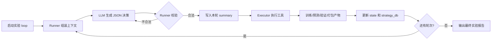
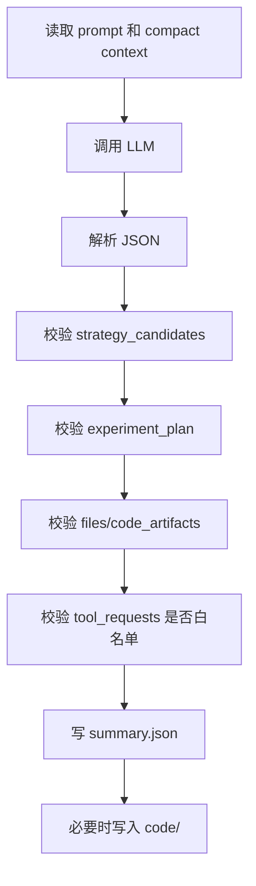
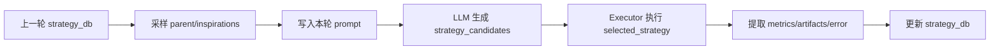
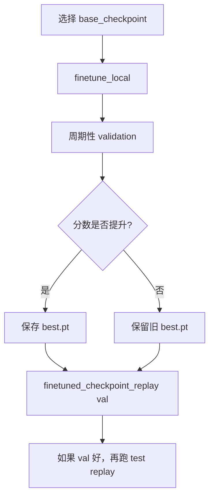
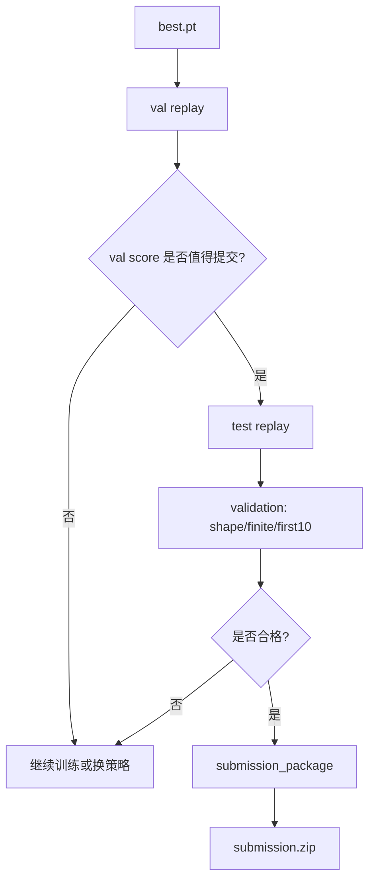
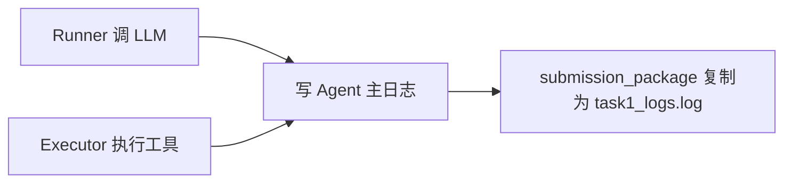

# Task1 Agent 架构说明

这份文档用来说明当前 Task1 自动科研 Agent 的整体设计。重点不是列代码细节，而是说明一轮实验从“规划策略”到“训练、验证、打包提交”的完整链路。

## 一句话概览

当前系统是一个自动实验闭环：

> Loop 创建实验目录 -> Runner 调用 LLM 产出 JSON 策略 -> Runner 校验 JSON 和代码契约 -> Executor 执行白名单工具 -> 结果写回 state 和策略池 -> 下一轮继续决策 -> 最后生成 submission。



## 只需要记住的几个入口

| 模块 | 作用 | 你通常关心什么 |
|---|---|---|
| `task1_agent_loop.py` | 控制多轮实验 | 创建实验、推进轮次、维护 state |
| `task1_agent_runner.py` | 调 LLM 并校验输出 | prompt、JSON schema、代码契约 |
| `task1_tool_executor.py` | 执行白名单工具 | 训练、replay、validation、submission |
| `task1_finetune_local.py` | 本地 FNO 微调 | 学习率、步数、样本数、worker、warm-start |
| `task1_planner.md` | Agent 的主 prompt | 硬规则、评分目标、策略要求 |
| `action_schema.json` | LLM 输出格式约束 | 必填字段、工具参数、候选策略格式 |

实验产物统一放在每次实验自己的目录里。平时只需要看：

| 位置 | 内容 |
|---|---|
| `logs/task1_logs.log` | 本次实验的 LLM/工具主日志 |
| `logs/turn_xxx/summary.json` | 每轮 Agent 决策摘要 |
| `logs/executor/*.json` | 每轮工具执行结果 |
| `runs/` | 训练、replay、prediction、checkpoint |
| `code/` | Agent 生成的可追溯代码快照 |
| `submission.zip` 或 `submissions/*.zip` | 最终提交包 |

## 每轮 Agent 输出什么

Runner 要求 LLM 每轮必须输出一个 JSON object，而不是普通文字。核心字段如下：

| 字段 | 作用 | 为什么重要 |
|---|---|---|
| `decision` | 本轮选择的路线和原因 | 让实验选择可解释 |
| `strategy_candidates` | 2-4 个候选策略 | 强制先比较，再执行 |
| `selected_strategy_id` | 本轮最终执行哪个策略 | 便于追踪策略池 |
| `experiment_plan` | 阶段、预算、时间和分数权衡 | 避免盲目训练 |
| `tool_requests` | 请求 executor 执行的工具 | 把想法变成动作 |
| `files` / `code_artifacts` | 本轮生成的新代码 | submission 需要可追溯代码 |
| `memory_update` | 本轮假设和结论 | 给后续轮次提供上下文 |

简化后的结构：

```json
{
  "decision": {"route": "...", "reason": "..."},
  "strategy_candidates": [
    {"id": "s1", "route": "...", "execute_now": true},
    {"id": "s2", "route": "...", "execute_now": false}
  ],
  "selected_strategy_id": "s1",
  "experiment_plan": {"stage": "promotion", "workflow_module": "checkpoint_finetune"},
  "tool_requests": [
    {"tool": "finetune_local", "steps": 100, "lr": 0.000002},
    {"tool": "finetuned_checkpoint_replay", "split": "val"}
  ]
}
```

## Prompt 设计

Prompt 的职责不是让模型自由聊天，而是给 Agent 明确边界。

| Prompt 约束 | 目的 |
|---|---|
| 当前实验是唯一提交边界 | 防止直接拿旧实验预测或日志提交 |
| 历史 checkpoint 可 warm-start | 允许从高分 FNO checkpoint 继续训练 |
| 每轮必须给策略候选 | 避免单一路线拍脑袋执行 |
| replay/test/package 的硬规则 | 防止拿 val prediction 打包 |
| direct API 日志优先当前实验日志 | 不依赖 8080 proxy |
| submission 必须有 code 快照 | 满足可追溯性 |

关键区别：

| 不允许 | 允许 |
|---|---|
| 直接拿旧实验 prediction 打包 | 用旧高分 FNO checkpoint 作为 `base_checkpoint` 继续训练 |
| 直接拿 val run 打包 | 先跑 test replay，再打包 |
| 没有 code 文件就 submission | 生成最小可执行 package/predict 入口后打包 |
| Unet-PF 传给 `finetune_local` | FNO checkpoint 传给 `finetune_local` |

## Runner 的职责

Runner 是 LLM 和本地工具之间的“把关层”。



Runner 主要做这些检查：

| 检查项 | 解决的问题 |
|---|---|
| JSON-only | 防止 LLM 输出 Markdown 或解释文字 |
| schema 合法 | 防止缺字段 |
| strategy 选择一致 | 防止候选策略和执行工具脱节 |
| workflow/tool 白名单 | 防止 Agent 调任意命令 |
| code artifact 契约 | 防止只生成 README 或空 code |
| submission 前 code 检查 | 防止最终提交缺代码快照 |

## Executor 的职责

Executor 是真正执行实验的地方。它只接受白名单工具请求。

| 工具 | 用途 | 典型输入 | 典型输出 |
|---|---|---|---|
| `checkpoint_replay` | 跑官方 checkpoint baseline | target, split | prediction, metrics |
| `finetune_local` | 本地 FNO 微调 | base checkpoint, lr, steps | best.pt, train log |
| `finetuned_checkpoint_replay` | 用微调 checkpoint replay | checkpoint, split | prediction, metrics |
| `validation` | 校验 HDF5 预测 | prediction, input | shape/finite/first10 |
| `llm_log_prepare` | 整理 LLM 日志 | task1_logs.log | 合规日志 |
| `submission_package` | 生成提交包 | test run, log, code | submission.zip |
| `data_shape_check` | 检查数据形状 | hdf5 paths | shape report |

Executor 还负责一些自动修正：

| 场景 | Executor 行为 |
|---|---|
| Agent 给 val run 去打包 | 拒绝或自动补 test replay |
| direct API 没有 proxy 日志 | 使用当前实验 `task1_logs.log` |
| Agent 写了自定义 run_dir | replay 尽量尊重 run_dir basename |
| test validation 带了 target | 不把 test 当有标签数据算 metric |
| 多个连续 finetune 请求 | 可以并发执行 |

## 实验状态和策略池

系统维护一个轻量的 OpenEvolve 式策略池 `strategy_db`。

它不是复杂数据库，而是在实验 state 中记录：

| 内容 | 作用 |
|---|---|
| `programs` | 已尝试过的策略 |
| `archive` | 高分策略摘要 |
| `best_strategy_id` | 当前最好策略 |
| `islands` | 简单分组，保持探索多样性 |
| `feature_map` | 按训练模块、样本量、rollout 等特征归档 |
| `active_parent_id` | 下一轮参考的父策略 |
| `active_inspiration_ids` | 下一轮可借鉴的策略 |



这套设计的目标是：

| 目标 | 说明 |
|---|---|
| 不重复低价值策略 | 已失败路线会记录 error |
| 保留高分路线 | 高分策略进入 archive |
| 支持 warm-start | 高分 checkpoint 可作为后续 base checkpoint |
| 便于比较 | 每个策略有成本、收益、风险 |

## 训练链路

当前主训练工具是 FNO 微调。



关键训练参数：

| 参数 | 作用 | 当前经验 |
|---|---|---|
| `base_checkpoint` | 起点 checkpoint | 高分 all-train checkpoint 可继续训 |
| `lr` | 学习率 | continuation 要小，`2e-6` 有效，`2e-5` 会退化 |
| `steps` | 训练步数 | warm-start 先试 50-150 |
| `max_samples` | 训练样本数 | probe 可 2048，promotion 再扩大 |
| `trainable` | 训练哪些参数 | all 能涨分，但更敏感 |
| `num_workers` | DataLoader worker | 当前机器 `4` 是较好默认 |
| `rollout_steps` | 多步监督 | 当前主要用 1，稳定优先 |

已经验证的经验：

| 策略 | 结果 |
|---|---|
| 从 official FNO 训练 500 steps/all | 可到约 74+ |
| 从高分 all-train checkpoint 用 `lr=2e-5` 继续训 | 退化 |
| 从高分 all-train checkpoint 用 `lr=2e-6` 继续训 | 标准 val replay 到约 75.4 |

## 验证和提交链路

提交前必须经过 test replay。



提交必须满足：

| 条件 | 要求 |
|---|---|
| prediction shape | `[1000, 200, 256]` |
| dataset key | `tensor` |
| 初始帧 | 前 10 帧与 test input 一致 |
| 数值 | 全部 finite |
| 推理时间 | 小于 120 秒 |
| 日志 | 当前实验 LLM 日志 |
| 代码 | 当前实验 `code/` 中有可执行快照 |

## 日志设计

现在有两类日志：

| 日志 | 用途 |
|---|---|
| Agent 主日志 | 记录 LLM response 和 tool calls，最终可用于提交 |
| Executor 日志 | 记录每个工具的命令、stdout、stderr、结果 |

direct API 模式下，不再依赖 8080 proxy 日志。



## 常见失败和当前防护

| 失败 | 原因 | 当前防护 |
|---|---|---|
| 日志全是 prompt | 读了旧 proxy 日志 | direct API 优先读当前实验日志 |
| val prediction 被拿去打包 | val 只有 100 条 | submission 必须 test run |
| 下游找错 run_dir | Agent 自定义名和 executor 输出名不一致 | replay 尊重 run_dir basename |
| test validation 算 metric 失败 | test 没有标签 | test 只做 shape/finite/first10 |
| submission 缺 code | 没生成代码快照 | Runner 要求 package/predict 入口 |
| Unet checkpoint 传给 FNO 微调 | 工具不支持 | executor 直接拒绝 |
| continuation 退化 | 学习率过大 | warm-start 推荐小 LR |

## 一次完整成功路线

| 阶段 | 操作 | 产物 |
|---|---|---|
| 1. 建 baseline | `checkpoint_replay` | baseline metrics |
| 2. cheap probe | `finetune_local` | 初始 `best.pt` |
| 3. promotion | warm-start 小 LR 继续训 | 更好的 `best.pt` |
| 4. val replay | `finetuned_checkpoint_replay split=val` | 标准 val score |
| 5. test replay | `finetuned_checkpoint_replay split=test` | 1000 条预测 |
| 6. validation | `validation` | shape/finite/first10 |
| 7. code snapshot | Agent 生成 package/predict 入口 | `code/` |
| 8. package | `submission_package` | `submission.zip` |

## 后续可以加的能力

| 方向 | 怎么加 | 风险 |
|---|---|---|
| 物理约束 loss | 给 `finetune_local` 加 Burgers residual loss | 权重过大会压低比赛 metric |
| LR 小网格搜索 | 并发跑 `1e-6/2e-6/5e-6` | 需要控制训练时间 |
| 分段后处理 | 针对不同时间段调 correction | 容易过拟合 val |
| ensemble | 多 checkpoint 平均或加权 | 推理时间可能超 120s |
| Unet-PF 微调 | 新增可执行 Unet 训练入口 | 工程量更大 |

物理约束建议先作为轻量正则：

```text
loss = supervised_mse + lambda_phys * residual_loss
residual = u_t + u * u_x - nu * u_xx
```

推荐先试：

| 参数 | 初始建议 |
|---|---|
| `lambda_phys` | `1e-6` 或 `1e-5` |
| `nu` | `0.001` |
| base checkpoint | 当前最高分 FNO checkpoint |
| lr | `1e-6` 到 `2e-6` |
| steps | 50 到 150 |

## 当前架构的核心原则

| 原则 | 含义 |
|---|---|
| 策略自由，执行受控 | Agent 可以想策略，但只能通过白名单工具执行 |
| 当前实验闭环 | 最终提交只来自当前实验产物 |
| 历史可 warm-start | 高分 checkpoint 可以继续训练，但不能直接提交 |
| 先验证再提交 | val 看分，test 打包 |
| 小步试探 | 高分 checkpoint continuation 要小 LR、短步数 |
| 日志和代码可追溯 | submission 必须能追到 LLM 日志和 code 快照 |

